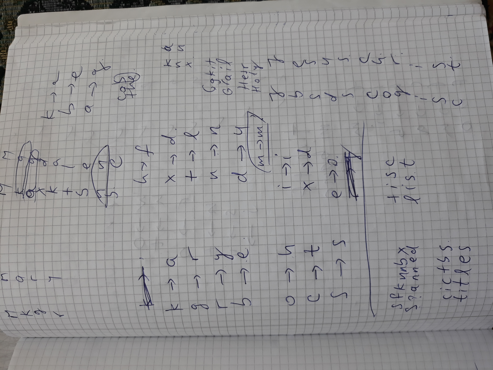
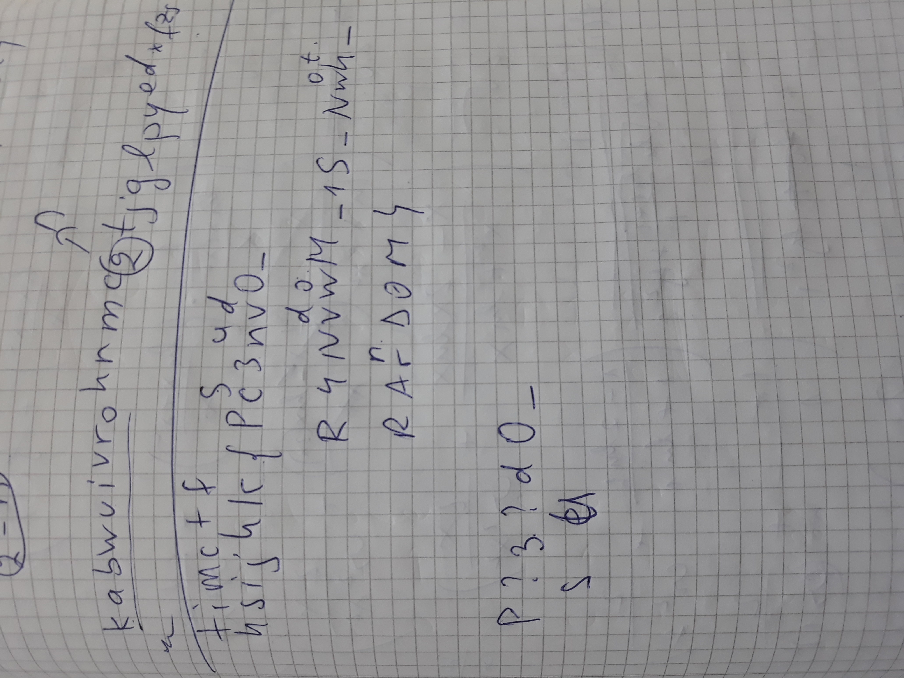

Substitute teacher
=====

* Tools used: Python, pen & paper

We observed that the given text was enciphered using a substitution ciper on the lowercase letters. So, we looked for clues about the permutation applied.

Firstly, we recognized words and phrases, such as:

* Mkgr Mkaxktbnb -> Mary Magdalene
* Jbsds Cogisc -> Jesus Christ
and so on...

Using them, we managed to get the permutation used, using a Python script, pen and paper:

