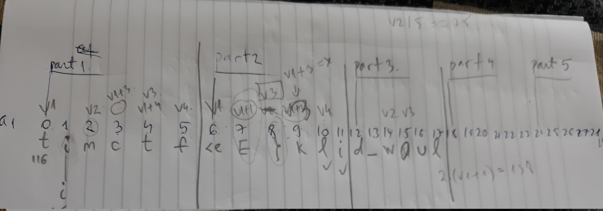

Math exam
====

* Tools used: [Retargetable decompiler](https://retdec.com/decompilation/), pen & paper

Firstly, we decompiled the given executable, and followed the if statements line by line on paper.



We got:
```
timctf{Euclid_w0uld_b3_pr0ud}
```
